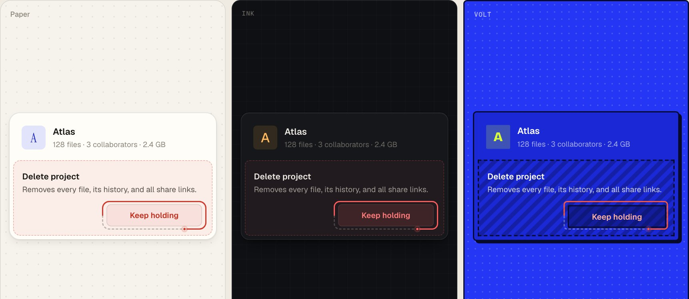

# ui-playground

A laboratory of small, specific UI patterns. Each one answers an everyday interface job with a single inventive move, and each is storyboarded, tunable live, and built to look deliberate in three very different themes.



The working method borrows from **Interface Craft** by Josh Puckett: animations you can read like a script, values you can tune with live controls, and critique that names the specific detail. The patterns themselves are original.

## The patterns

| # | Pattern | Job | The move |
| --- | --- | --- | --- |
| 01 | **Inchworm** | Selection | Segmented control where each edge of the pill rides its own spring (the leading edge reaches, the trailing edge follows) and labels invert exactly where the pill overlaps them. |
| 02 | **Detent** | Input | Compact numeric fields you scrub sideways. A ruler unfurls only while you drag, and meaningful values click like hardware detents. |
| 03 | **Fuse** | Confirmation | Hold to commit, with a fuse burning around the button. The same fuse then burns back down as the undo window, on the button itself. |
| 04 | **Loupe** | Data density | A one-line-per-row list with a travelling magnifier: the focused row opens its detail while emphasis falls off with distance. |
| 05 | **Sieve** | Filtering | Excluded items fly into a tray grouped by the filter that caught them. Chips show their cost (−n / +n), and zero results names the culprit. |
| 06 | **Ledger** | Progressive disclosure | A multi-step form that is always a receipt: todo lines, one open card, answers folded back into lines. The receipt is the review. |
| 07 | **Origami** | Navigation | Breadcrumbs that fold middle folders into countable paper pleats instead of “…”, and unfold in place on hover or focus. |
| 08 | **Strata** | Feedback | Toasts settle into severity-coloured bands that compact with age. Errors stay unread until you look, and the bands open back into a history. |

Every pattern page has a **Try** prompt for its key moment, craft notes, keyboard support and a link to the source.

## Run it

```bash
npm install
npm run dev        # http://localhost:5173
```

`npm run build` type-checks and builds to `dist/`. pnpm and yarn work too. Requires Node 20.19+ (Vite 8).

### In the gallery

| Key | |
| --- | --- |
| `[` `]` | Previous / next pattern |
| `T` | Cycle theme (Paper → Ink → Volt) |
| `C` | Compare: render the pattern in all three themes side by side |
| `D` | Dials: live tuning panel for the current pattern |

Theme, compare and dials state persist across reloads.

## Themes

Themes are CSS custom properties scoped to `[data-theme]` (`src/styles/tokens.css`). Any subtree can wear its own theme, which is how compare mode renders one pattern three ways at once. A theme sets more than colour:

| | Paper | Ink | Volt |
| --- | --- | --- | --- |
| Feel | Editorial print | Night instrument panel | Poster |
| Accent | Blue pencil | Amber phosphor | Chartreuse on Klein blue |
| Selection | Filled with ink | Lit amber, with glow | Chartreuse, hard outline |
| Elevation | Soft, layered, directional | Top highlight + hairline, no shadow to speak of | Hard offset shadows; pressing removes the offset |
| Geometry | 8–18px radii | 6–14px radii | 0–6px radii, 2px strokes |
| Voice | Instrument Serif display, sentence-case labels | Geist display, mono uppercase labels | Bricolage Grotesque 800, mono uppercase labels |

Patterns only read tokens (`--surface`, `--edge`, `--selected-bg`, `--danger-ink`, `--hazard-bg`, `--shadow-2`, `--label-case`…). Two rules keep them honest:

- **Never style by theme name.** `[data-theme='ink'] .x` leaks into nested themes, so any per-theme difference becomes a token.
- **Semantic pairs, not raw colours.** For example, `--danger-ink` is danger as *text on a surface*. On Volt that's a light coral, because red on Klein blue vibrates.

## Dials

A lean take on the DialKit idea: declare a schema next to your constants, read live values back, and the gallery renders controls for every mounted schema.

```tsx
const dials = useDials('Fuse', {
  holdMs: [1100, 400, 3000, 50],                           // slider: default, min, max, step?
  spark: true,                                             // toggle
  rewind: { type: 'spring', visualDuration: 0.35, bounce: 0 }, // spring editor with a live curve
  leader: { type: 'select', options: ['dots', 'dashes'], default: 'dots' },
  replay: { type: 'action' },                              // a counter that bumps on click
})
```

- Instances with the same name share values, so in compare mode one set of dials drives all three themes.
- The spring editor plots the exact curve Motion resolves from `visualDuration` and `bounce`.
- **Copy** serializes the tuned values as a paste-ready constant; **Reset** restores defaults. Double-click a slider to reset just that one.

Source: `src/lib/dials/`.

## How patterns are written

Each pattern follows the Interface Craft storyboard conventions:

1. **A storyboard comment** at the top of the component: the sequence as a shot list, readable before the code.
2. **Named constants**: `TIMING`, and an UPPERCASE config object per animated element. No magic numbers in JSX.
3. **One state value** drives each sequence (a stage, a phase, a single motion value like Fuse's `burn`), not scattered booleans.
4. **Springs by default.** Interruptible motion that lands somewhere sensible when you change your mind mid-flight.
5. **Data-driven.** Repeated things are arrays and `.map()`.

Plus the house rules: keyboard and screen-reader support, `prefers-reduced-motion` respected (via `MotionConfig`), and demos that are self-contained (no portals, no globals) so they can render three times side by side.

## Add a pattern

1. Create `src/patterns/<name>/` with:
   - `<Name>.tsx`: the reusable component, storyboard comment at the top, tuning object exported with defaults.
   - `<Name>Demo.tsx`: a small, realistic context that shows the pattern doing its job. Wire tuning through `useDials('<Name>', …)`.
   - `*.module.css`: styles that only read theme tokens.
   - `index.ts`: exports a `PatternMeta` (`slug`, `name`, `job`, `tagline`, `try`, `summary`, `craft`, `keys`, `Demo`, `source`).
2. Add it to the list in `src/patterns/index.ts`.
3. Check it in compare mode (`C`) at desktop width and at 390px. It should look intentional in Paper, Ink and Volt, not just legible.

## Structure

```
src/
  styles/        tokens.css (themes) · base.css · ui.css (shared button/chip/card/input)
  lib/dials/     useDials store, panel, spring curve
  gallery/       shell: topbar, sidebar, pattern page, home
  patterns/      one folder per pattern + registry
  themes.ts      theme metadata + persistence
```

Stack: React 19, TypeScript, Vite, [Motion](https://motion.dev). No other runtime dependencies.

## Deploy

`.github/workflows/pages.yml` builds with `BASE_PATH=/ui-playground/` and publishes to GitHub Pages. It skips until Pages is enabled: **Settings → Pages → Source: GitHub Actions**. After that, every push to `main` deploys to <https://wustep.github.io/ui-playground/>.

## Credits

Method and principles: **Interface Craft** by Josh Puckett (storyboard animation, DialKit, design critique). This repo borrows the ideas rather than the code or the demos.
